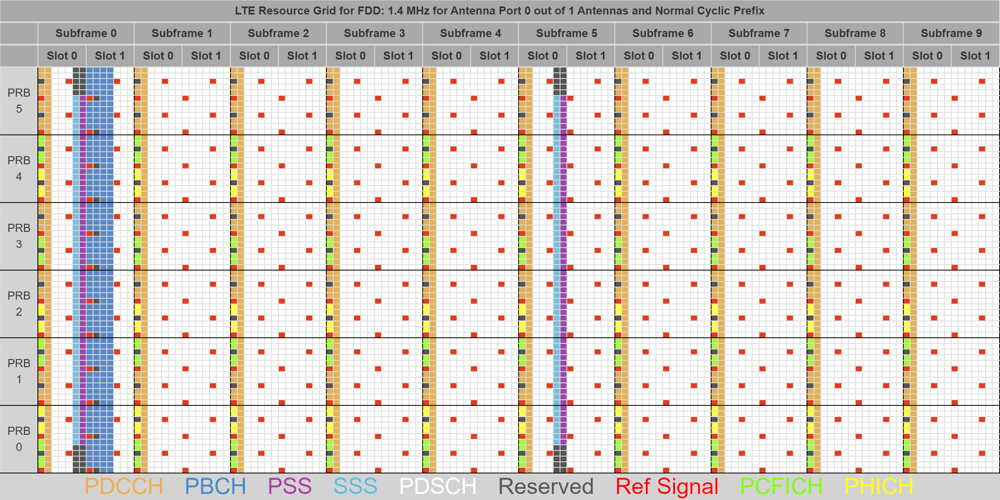

# LTE-resource-grid
Modified 1.4 MHz LTE resource grid graphic based on work by from Sandesh Dhagle.

Original work is available on https://dhagle.in/LTE.php.

PNG and GIMP files are available in this repository.

Modifications:
- Removel of the fourth (last) header row.
- Addition of a custom legend at the bottom of the graphic based on the original legend.

As the original this derived work is licensed under the Creative Commons Attribution-ShareAlike 4.0 International License. 

License text is available at https://creativecommons.org/licenses/by-sa/4.0/.
